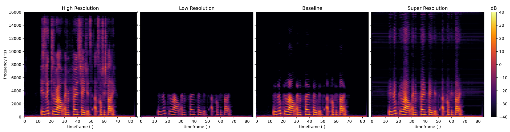

# Deep Learning: Architectures & Methods Project: Deep Learning for Audio Super-Resolution

Figure: Example visualization of the method and baseline as a spectogram


This is the implementation of our Project for the course "Deep Learning: Architectures and Methods" by Prof. Christian Kersting from the [Artificial Intelligence and Machine Learning Lab](https://www.ml.informatik.tu-darmstadt.de/) at the Technical University of Darmstadt in the summer semester 2021.


In the field of audio signal processing, Super-Resolution is one of the most relevant topics. The motivation is to reconstruct high- quality audio from low-quality signals. From a practical perspective, the technique has applications in telephony or generally in applications in which audio is transmitted and has to be compressed accordingly. Other applications are the processing of ancient recordings, for example old sound recordings of music, speech or videos. First approaches of the combination of machine learning and audio signal processing lead to promising results and outperform standard techniques.
Accordingly the scope of the project was to reimplement the paper [Temporal FiLM: Capturing Long-Range SequenceDependencies with Feature-Wise Modulation](https://papers.nips.cc/paper/2019/file/2afc4dfb14e55c6face649a1d0c1025b-Paper.pdf) by Birnbaum et al. in PyTorch, reproduce the results and extend them further to the music domain.

This repository contains everything needed to prepare the data sets, train the model and create final evaluation and visualization of the results. We also provide the weights of the models to reproduce our reported results. 


## Installation
This project was originally developed with Python 3.8, PyTorch 1.7, and CUDA 11.0. The training requires 
at least one NVIDIA GeForce GTX 980 (4GB memory).

- Create conda environment:
```
conda create --name audiosr
source activate audiosr
```
- Install PyTorch >=1.7 (see [PyTorch instructions](https://pytorch.org/get-started/locally/)). For example,
```
conda install PYTORCH torchvision cudatoolkit=11.0 -c pytorch
```
- Install the dependencies:
```
pip install -r requirements.txt
```

## Dataset preparation

To reproduce the results shown below tha datasets have to be prepared. This repo includes scripts to prepare the following dataset:

- [VCTK](https://datashare.is.ed.ac.uk/bitstream/handle/10283/3443/VCTK-Corpus-0.92.zip)
- [GTZAN](https://www.kaggle.com/andradaolteanu/gtzan-dataset-music-genre-classification)
- [Piano Dataset](https://drive.google.com/drive/folders/0B7riq_C8aslvbWJuMGhJRFBmSHM?resourcekey=0-fM79ZaHDzE4IPUMzDUK6uA) (Beethoven Sonatas)


### VCTK preparation

- run prep_dataset.py from ./datasets to create a h5 container of a specified input.
- to reproduce results prepare the following h5 files:

```
python prep_dataset.py \
  --file-list vctk/speaker1/speaker1-train-files.txt \
  --in-dir ./VCTK-Corpus/wav48/p225/ \
  --out vctk-speaker1-train.4.16000.8192.4096.h5 \
  --scale 4 \
  --sr 16000 \
  --dimension 8192 \
  --stride 4096 \
  --interpolate \
  --low-pass
```

```
python prep_dataset.py \
  --file-list vctk/speaker1/speaker1-val-files.txt \
  --in-dir ./VCTK-Corpus/wav48/p225/ \
  --out vctk-speaker1-val.4.16000.8192.4096.h5 \
  --scale 4 \
  --sr 16000 \
  --dimension 8192 \
  --stride 4096 \
  --interpolate \
  --low-pass
```

### GTZAN preparation

- run prep_dataset.py from ./datasets to create a h5 container of a specified input.
- to reproduce results prepare the following h5 files:

```
python prep_dataset.py \
  --file-list gtzan/blues_wav_list_train.txt \
  --in-dir gtzan/data/genres/blues/ \
  --out blues-train.4.22000.8192.16384.h5 \
  --scale 4 \
  --sr 22000 \
  --dimension 8192 \
  --stride 16384 \
  --interpolate \
  --low-pass
```

```
python prep_dataset.py \
  --file-list gtzan/blues_wav_list_val.txt \
  --in-dir gtzan/data/genres/blues/ \
  --out blues-val.4.22000.8192.16384.h5 \
  --scale 4 \
  --sr 22000 \
  --dimension 8192 \
  --stride 16384 \
  --interpolate \
  --low-pass
```

### Piano dataset preparation

- for this dataset the split from https://github.com/soroushmehr/sampleRNN_ICLR2017 is used
- run prep_piano.py from ./datasets/music_dataset to create a h5 container of a specified input.
- to reproduce results prepare the following h5 files:

```
python prep_piano.py \
  --file-list data/music_train.npy \
  --out piano-train.4.16000.8192.131072.h5 \
  --scale 4 \
  --sr 16000 \
  --dimension 8192 \
  --stride 131072 \
  --interpolate \
  --low-pass
```

```
python prep_piano.py \
  --file-list data/music_valid.npy \
  --out piano-val.4.16000.8192.131072.h5 \
  --scale 4 \
  --sr 16000 \
  --dimension 8192 \
  --stride 131072 \
  --interpolate \
  --low-pass
```

Notes: 
- the --in-dir argument has to be adapted to the respective dataset location
- The dimension parameter and sampling rate define the absolute length of a patch (dim/sr = length patch)


## Model
Generally, there are three main models in this implementation. 
### Baseline
On the one hand the b-spline interpolation which serves as the baseline and can be found in the data loader in `prep_dataset.py`. 
### Model
On the other hand two neural networks whose implementation can be found in the ``/models/`` folder. In a first step a model was implemented which uses a batchnorm layer instead of the later used TFILM layer. This is implemented in `audiounet.py`. 
The final model, which is also used in the paper, can be found in `tfilmunet.py`.

### Train Model
To run the trainings use the following commands and change the dataset root the corresponding domain.

```
python train.py \
  --dataset-root hereroottodataset! \
  --epochs 50 \
  --lr 3*10e-4 \
  --batch-size 16 
```


## Evaluation

### Save examples from inference

It is possible to evaluate any given wav-file with the inference.py script by invoking the --save-example flag and saving the results as wav-files and spectrogram plots. The script performs the following steps:

- prepares all files in a provided list (--wave-file-list) and creates a low-res version and the baseline reconstruction
- runs inference on the prepared files to create a super-resolution output
- saves all results to the "examples" folder with the respective file names
- saves spectrogram plots of all versions as pdf-files

Notes:

It is important to adapt the sampling parameter (--sr) which is set to 16000 by default. The sampling rate has to be the one of the original wav file. The scale (--scale) defines the down sampling factor which is set to 4 by default. Depending on which trained model is used for the inference the parameters --checkpoints-root and --checkpoint have to be specified accordingly.

To reproduce an example from our plot run the following command from the repo root directory (modify --checkpoints-root if necessary):

```
python inference.py \
  --save-example \
  --wave-file-list assets/save_wav_list.txt \
  --scale 4 \
  --sr 16000 \
  --checkpoint pretrained/vctk_speaker1_pretrained.pth
```


## Results

|Training Dataset       | Ratio     | *BASELINE* SNR (dB) | *BASELINE* LSD (dB)  | *METHOD* SNR (dB) | *METHOD* LSD (dB)  | Checkpoint  |
|-----------------------|-----------|--------|--------|--------|--------|-------------|
|*VTCK SingleSpeaker*   | r = 4     | 15.6   | 5.4    | 16.6   | 3.2    | [Checkpoint](https://drive.google.com/file/d/1Ezj0LeLP_9bAXKruHJcvpg11eXQkZO6X/view?usp=sharing)| 
|*Piano*                | r = 4     | 19.7   | 2.9    | 20.4   | 2.2    | [Checkpoint](https://drive.google.com/file/d/1HhtghseazOR1bjfakcNVNRMyBDao5b3n/view?usp=sharing)|
|*GTZAN (Genre: Blues)* | r = 4     | 13.3   | 7.8    | 13.8   | 3.8    | [Checkpoint](https://drive.google.com/file/d/1Ezj0LeLP_9bAXKruHJcvpg11eXQkZO6X/view?usp=sharing)|


### Qualitative Examples
Here we provide a qualitative example per Dataset. These can be generated using ``inference.py``

| **VTCK SingleSpeaker** | **Piano** | **GTZAN (Genre: Blues)**  |
|------|-------|--------|
|[Low Resolution](assets/VTCK/p225_358_low_res.wav) |[Low Resolution](assets/Piano/BeethovenPianoSonata19_low_res.wav) | [Low Resolution](assets/GTZAN/blues.00061_low_res.wav) | 
|[Baseline](assets/VTCK/p225_358_base.wav)  |[Baseline](assets/Piano/BeethovenPianoSonata19_crop_base.wav)  | [Baseline](assets/GTZAN/blues.00061_base.wav) |
|[Method](assets/VTCK/p225_358_super.wav)   | [Method](assets/Piano/BeethovenPianoSonata19_super.wav)| [Method](assets/GTZAN/blues.00061_super.wav)|
|[High Resolution](assets/VTCK/p225_358_gt.wav) | [High Resolution](assets/Piano/BeethovenPianoSonata19_gt.wav)| [High Resolution](assets/GTZAN/blues.00061_gt.wav)|

